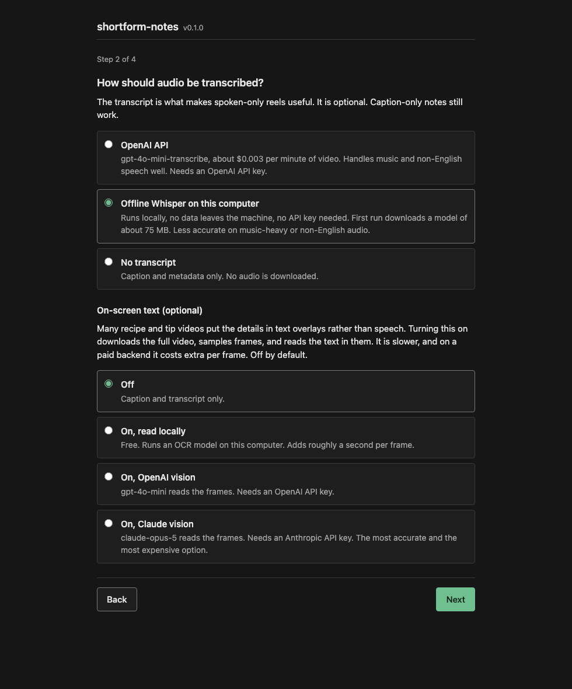
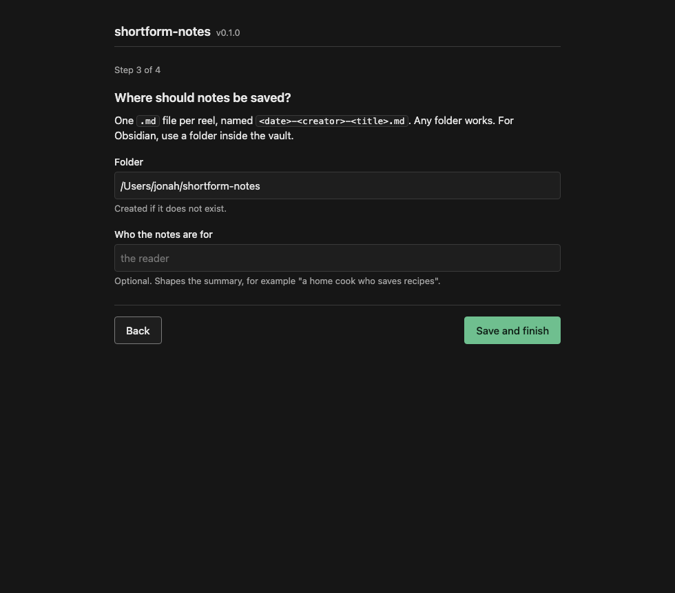
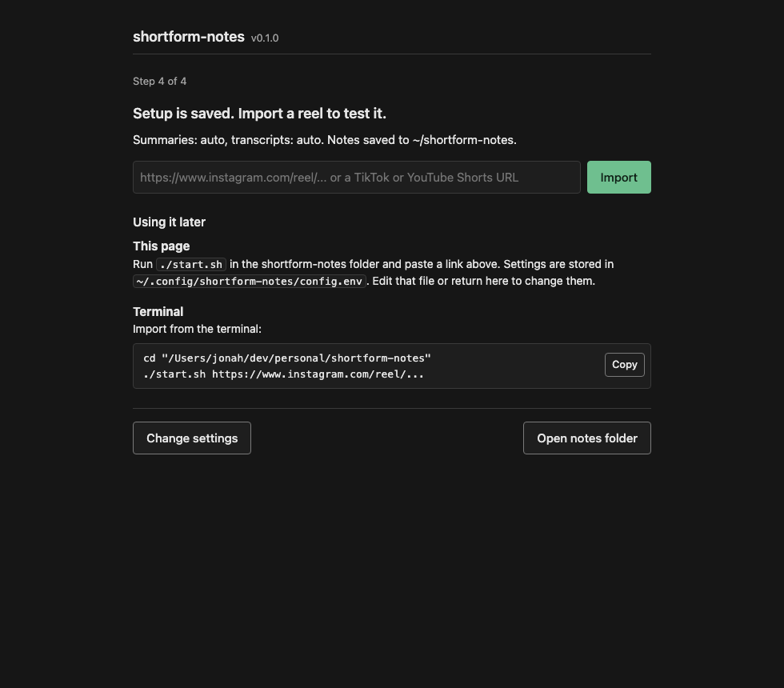

# shortform-notes

Turn Instagram Reels, TikToks and YouTube Shorts into Markdown notes: caption, transcript, and a short summary with the takeaways. One command, no API key required.

```
$ shortform-notes https://www.instagram.com/reel/DQCkNLtgqEe/

saved ~/shortform-notes/2025-10-20-teddysphotos-symmetry-with-karan-aujla-play-remixes-ep.md  (sources: caption, transcript)
  Symmetry with Karan Aujla, Play Remixes EP
  The video promotes the song Symmetry featuring Karan Aujla, released as part of the Play remixes EP. The creator says Karan Aujla taught them Punjabi for a bit in the video and asks viewers how they did.
  - Song: Symmetry featuring Karan Aujla (@karanaujla)
  - Released as part of the Play remixes EP, out now
  - Karan Aujla taught the creator Punjabi for the bit shown in the video
  - The creator asks viewers to judge how their Punjabi sounded
```

The summary can run through Claude Code or Codex (the subscription you already have), or through an OpenAI or Anthropic API key. Transcripts come from OpenAI or from Whisper running offline on your own machine. Everything degrades on its own: with nothing configured you still get the caption and metadata.

Notes are plain Markdown with YAML frontmatter, so they work in Obsidian, Logseq, or a folder.

## Quick start

```bash
git clone https://github.com/adenjonah/shortform-notes && cd shortform-notes && ./start.sh
```

`start.sh` installs [uv](https://docs.astral.sh/uv/) if it is missing, uv installs Python and every dependency, and then the script asks one question:

```
How do you want to set up shortform-notes?
  1) In the browser (recommended if you are not used to the terminal)
  2) In this terminal
```

Windows: run `start.ps1`. macOS users who prefer not to open a terminal can double-click `Start.command`.

### Browser setup

Option 1 opens a local page at 127.0.0.1. Four steps, then a box to paste a link.

**Step 1. Where the summary runs.** Claude Code and Codex need no key. The API options show a key field; the key is written to the local config file and nowhere else.


**Step 2. How audio is transcribed.** OpenAI (best quality, needs a key), offline Whisper (free, private, downloads a 75 MB model on first use), or skip. The same step has the optional on-screen text (OCR) switch, off by default, with a cost estimate that updates as you change the frame rate.



**Step 3. Where notes are saved.** Any folder. For Obsidian, use a folder inside the vault. An optional "who the notes are for" line shapes the summary.



**Step 4. Try one.** Paste a link and the note appears below with its title, summary, takeaways, and the full file. If you chose Claude Code or Codex, this page also shows a prompt to paste into that tool once; after that, pasting a reel link in any session imports it.



### Terminal setup

Option 2 runs `shortform-notes setup`, a numbered wizard that asks the same four questions and writes the same config file:

```
1/4  Where should the summary run?
  1) Claude Code: uses your Claude subscription through the claude CLI, no API key
  2) Codex CLI: uses your ChatGPT subscription through the codex CLI, no API key
  3) OpenAI API key: pay per use, about $0.001 per reel; also enables the best transcription
  4) Anthropic API key: pay per use with Claude via the API
  5) No summary: save the caption, transcript and metadata only
Choose 1-5 [1]:
```

Both paths write `~/.config/shortform-notes/config.env`. Once it exists, `./start.sh` opens the import page directly, `./start.sh setup` re-runs the wizard, and `./start.sh <url>` imports from the terminal. Nothing on your machine is scanned; both paths only ask.

### Everyday use

```bash
./start.sh https://www.tiktok.com/@chef/video/7301234567890123456     # one link
./start.sh <url1> <url2> <url3>                                        # several, one note each
./start.sh <url> --json                                                # machine-readable output
```

Or, from Claude Code after pasting the prompt from step 4: drop a link into the chat and ask for the takeaways.

### Install as a CLI instead

```bash
pipx install "shortform-notes[all] @ git+https://github.com/adenjonah/shortform-notes"
```

Requires Python 3.10+. ffmpeg is not needed. Extras:

| Extra | Adds | Use it when |
|---|---|---|
| *(none)* | caption + metadata, Claude Code / Codex summaries | you want to run without any API key |
| `openai` | API transcription + summaries | you have `OPENAI_API_KEY` |
| `anthropic` | Claude API summaries | you have `ANTHROPIC_API_KEY` |
| `local` | offline Whisper transcription (faster-whisper, ~75 MB model on first run) | you want transcripts without a key |
| `ocr` | on-screen text from video frames (RapidOCR + OpenCV, no key) | the details are in text overlays, not speech |
| `mcp` | MCP server for Claude Code / Claude Desktop | you want it as an editor tool |
| `all` | `openai` + `anthropic` + `mcp` | |

## Backends for the two model steps

Two steps need a model: **transcribing** the audio and **summarizing** the text. Each step has several backends. `shortform-notes` picks the first available one in the order below; configuration is only needed to override that choice.

```
summary     OPENAI_API_KEY, then ANTHROPIC_API_KEY, then `claude` on PATH, then `codex` on PATH, else none
transcript  OPENAI_API_KEY, then faster-whisper if installed, else none
```

### Option A: your own API key

```bash
export OPENAI_API_KEY=sk-...          # transcription (gpt-4o-mini-transcribe) + summaries (gpt-4o-mini)
export ANTHROPIC_API_KEY=sk-ant-...   # summaries with Claude instead (claude-opus-5)
shortform-notes <url>
```

### Option B: Claude Code or Codex (no key)

If `claude` or `codex` is on your PATH and logged in, no further setup is needed:

```bash
shortform-notes <url>                        # auto-detects
shortform-notes --summary claude-code <url>  # or pin one
shortform-notes --summary codex <url>
```

Each reel is one subprocess call with the prompt on stdin:

- Claude Code: `claude -p --output-format json --tools "" --disable-slash-commands --no-session-persistence`
- Codex: `codex exec --sandbox read-only --ask-for-approval never --output-last-message <tmp> -`

All tools are disabled and no session is persisted. The agent receives only the caption and transcript. Set `SHORTFORM_NOTES_CLAUDE_CODE_MODEL` / `SHORTFORM_NOTES_CODEX_MODEL` to pick a model; otherwise the CLI's own default is used.

### Option C: fully offline transcript

```bash
pip install "shortform-notes[local]"
shortform-notes --transcribe local <url>     # auto-detected once faster-whisper is installed and no OPENAI_API_KEY is set
```

`SHORTFORM_NOTES_WHISPER_MODEL` picks the model size (`tiny`, `base`, `small`, `medium`, `large-v3`; default `base`). Combined with Option B, no API key is used at any step.

### Option D: on-screen text (OCR), off by default

Many recipe and tip videos put the details in text overlays rather than speech. OCR reads those. It is off by default because it downloads the whole video instead of just the audio, takes longer, and on a paid backend costs extra per frame.

```bash
shortform-notes --ocr <url>                              # local OCR, free
shortform-notes --ocr --ocr-provider openai <url>        # gpt-4o-mini vision
shortform-notes --ocr --ocr-fps 0 <url>                  # read every frame instead of one per second
```

How it works: frames are sampled at one per second (`--ocr-fps 1`, the default). `--ocr-fps 0` reads every frame, for fast-cut videos where text flashes for less than a second; `--ocr-fps 4` is a middle ground. Consecutive frames that look the same are dropped before any OCR call, so a video with a static overlay costs far less than the estimate. What is read goes into the note as a timestamped "On-screen text" section and into the summary prompt.

Cost estimate, before de-duplication, using the vendors' published prices as of 2026-08-24:

| Backend | Per frame | 30 s video at 1 frame/s | 60 s video at 1 frame/s | 30 s video, every frame |
|---|---|---|---|---|
| `local` (RapidOCR on your CPU) | free | free, about 10 s of compute | free | free, several minutes |
| `openai` (gpt-4o-mini, low detail, 2,833 tokens per frame at $0.15 per 1M) | $0.0004 | $0.013 | $0.025 | $0.38 |
| `anthropic` (claude-opus-5, about 980 tokens per frame at $5 per 1M) | $0.005 | $0.15 | $0.29 | $4.42 |

The CLI prints the estimate for a 30 s and 60 s video before running a paid backend, and the setup page shows the same numbers next to the frame-rate field. Set `SHORTFORM_NOTES_OCR_ANTHROPIC_MODEL=claude-haiku-4-5` to cut the Claude figure by five. The `ocr` extra is installed by `start.sh`; for a manual install use `pip install "shortform-notes[ocr]"`.

### Configuration reference

The setup page writes `~/.config/shortform-notes/config.env`; the CLI, MCP server and Claude Code skill all read it. Real environment variables override it, and flags override both:

| Variable | Flag | Default | What it does |
|---|---|---|---|
| `SHORTFORM_NOTES_SUMMARY_PROVIDER` | `--summary` | `auto` | `openai`, `anthropic`, `claude-code`, `codex`, `none` |
| `SHORTFORM_NOTES_TRANSCRIBE_PROVIDER` | `--transcribe` | `auto` | `openai`, `local`, `none` |
| `SHORTFORM_NOTES_DIR` | `-o/--out` | `reels` | Output directory (point it at your vault) |
| `SHORTFORM_NOTES_AUDIENCE` | | `the reader` | Who the summary is written for, e.g. `Jonah, a home cook` |
| `SHORTFORM_NOTES_CLAUDE_CODE_MODEL` | | CLI default | Model for `claude -p` |
| `SHORTFORM_NOTES_CODEX_MODEL` | | CLI default | Model for `codex exec` |
| `SHORTFORM_NOTES_WHISPER_MODEL` | | `base` | faster-whisper model size |
| `SHORTFORM_NOTES_OCR` | `--ocr` / `--no-ocr` | `0` | Read on-screen text from video frames |
| `SHORTFORM_NOTES_OCR_PROVIDER` | `--ocr-provider` | `auto` | `local` (free), `openai`, `anthropic`; auto picks openai when a key is set, else local |
| `SHORTFORM_NOTES_OCR_FPS` | `--ocr-fps` | `1` | Frames read per second; `0` reads every frame |
| `SHORTFORM_NOTES_OCR_OPENAI_MODEL` | | `gpt-4o-mini` | OpenAI vision model for OCR |
| `SHORTFORM_NOTES_OCR_ANTHROPIC_MODEL` | | `claude-opus-5` | Anthropic vision model for OCR |
| `SHORTFORM_NOTES_OPENAI_MODEL` | | `gpt-4o-mini` | OpenAI summary model |
| `SHORTFORM_NOTES_ANTHROPIC_MODEL` | | `claude-opus-5` | Anthropic summary model |

`shortform-notes --help` lists every option. `--json` gives machine-readable output; `--no-transcript` skips the audio download.

## Supported links

| Platform | URL shapes | Caption source | Notes |
|---|---|---|---|
| Instagram | `/reel/<code>`, `/reels/<code>`, `/p/<code>`, `/tv/<code>`, `/share/reel/<code>` | captioned-embed endpoint (no login) | Share links are resolved to the canonical shortcode; `?igsh=` tracking is stripped |
| TikTok | `tiktok.com/@user/video/<id>`, `vm.tiktok.com/<code>`, `vt.tiktok.com/<code>` | yt-dlp description | Short links are followed by yt-dlp |
| YouTube Shorts | `youtube.com/shorts/<id>`, `youtu.be/<id>` | yt-dlp description | Regular `watch?v=` URLs are intentionally not matched; this is a short-video tool |

Several links can be passed in one command; each becomes its own note.

## What a note looks like

```markdown
---
type: reel
platform: instagram
source: https://www.instagram.com/reel/DQCkNLtgqEe/
creator: "@teddysphotos"
posted: 2025-10-20
imported: 2026-08-24
duration_seconds: 26
sources: [caption, transcript]
tags: [reel]
---

# Symmetry with Karan Aujla on Play Remixes EP

**Source:** [instagram, @teddysphotos](https://www.instagram.com/reel/DQCkNLtgqEe/)

## Summary
...

## Key takeaways
- ...

## Caption
> verbatim caption

## Transcript
verbatim transcript

## On-screen text
[00:03] 2 cups flour, 1 tsp salt
[00:11] bake 425F 20 min
```

The last section only appears when OCR is on.

The `sources` field records which inputs actually produced the note, so a wrong summary can be traced to the input that produced it.

## How it works

```
URL -> detect platform
      +- Instagram: GET /p/<code>/embed/captioned/ -> caption, creator, duration   (no login, no key)
      +- any:       yt-dlp bestaudio -> description + .m4a audio                   (no ffmpeg)
                        |
                        v
              transcribe: OpenAI API  |  local faster-whisper  |  skip
              OCR (optional): sample frames -> local RapidOCR | OpenAI vision | Claude vision
                        |
                        v
              summarize:  OpenAI API  |  Anthropic API  |  claude -p  |  codex exec  |  skip
                        |
                        v
              reels/<date>-<creator>-<slug>.md
```

Three behaviors that are not obvious from the code:

1. **Instagram's captioned-embed page only renders its payload when the request carries `Sec-Fetch-Mode: navigate`.** Without it the response is a 600 KB JavaScript shell with status 200. Invalid shortcodes also return 200. The code checks for the `contextJSON` payload and ignores the status code.
2. **yt-dlp is deliberately unpinned.** Its Instagram extractor breaks and is fixed in point releases; pinned versions stop working within weeks. If Instagram fetches start failing, run `pip install -U yt-dlp` first.
3. **Do not give yt-dlp a custom User-Agent.** It pairs the UA with the rest of its browser fingerprint and Instagram rejects mismatches.

Every stage degrades independently: with no transcription backend the note is caption-only; on an LLM error the title is derived from the caption; if the embed is blocked the yt-dlp description is used. The import fails only when neither a caption nor audio could be fetched.

## Use it from Claude Code

Two optional integrations ship in the repo:

- **`/reel <url>` slash command**: `.claude/skills/reel/SKILL.md`. Clone the repo (or copy that folder into your own project's `.claude/skills/`) and Claude Code runs the pipeline and reports the takeaways in chat.
- **MCP server**: `.mcp.json` registers `shortform-notes mcp` (stdio). Any MCP client (Claude Code, Claude Desktop) then gets an `import_shortform_note(url)` tool. Install with the `mcp` extra.

Both call the same `import_reel()` function, which can also be used directly:

```python
import asyncio
from shortform-notes import import_reel

result = asyncio.run(import_reel("https://youtube.com/shorts/dQw4w9WgXcQ"))
print(result.path, result.takeaways)
```

## Limitations

- Public posts only. Private accounts, age-gated and login-walled content cannot be fetched.
- OCR is off by default; overlay-only recipes with no caption and no narration produce a thin note unless you turn it on.
- Music-only clips download but transcribe to nothing; the note records this in its warnings.
- Local Whisper (`base` on CPU) is weaker than the OpenAI backend on music-backed or non-English speech and returns an empty transcript rather than a guess. Try `SHORTFORM_NOTES_WHISPER_MODEL=small` or `medium`, or set `OPENAI_API_KEY`.
- Instagram rate-limits datacenter IPs more aggressively than residential ones. Empty embeds on a server are usually this rate limit.
- One video at a time is the intended use. It is a personal-notes tool. Bulk scraping is out of scope; respect the platforms' terms and creators' work.

## Development

```bash
git clone https://github.com/adenjonah/shortform-notes && cd shortform-notes
python -m venv .venv && . .venv/bin/activate
pip install -e ".[all,local,dev]"
pytest -q && ruff check src tests
```

Tests do not touch the network or spawn a CLI: fetchers, API clients and subprocesses are patched.

## License

MIT
