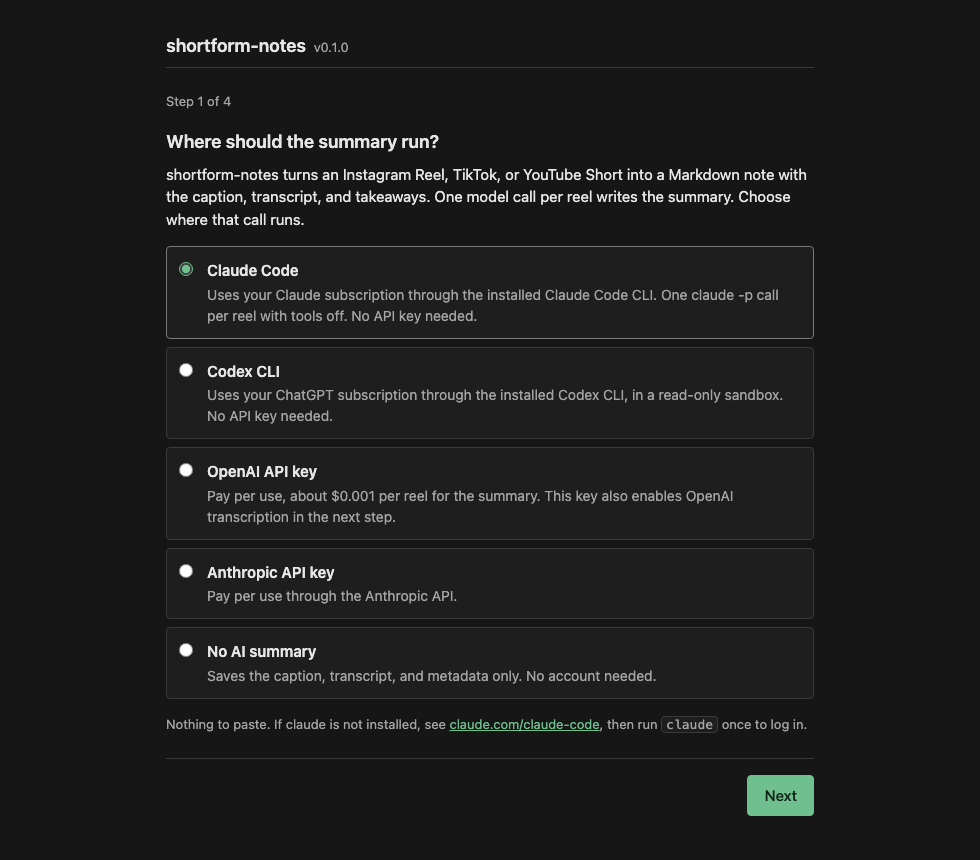

# shortform-notes

Turn Instagram Reels, TikToks and YouTube Shorts into Markdown notes: caption, transcript, and a short summary with the takeaways. One command, no API key required.

```
$ shortform-notes https://www.instagram.com/p/DS3DPehEnpA/

saved ~/shortform-notes/2025-12-29-recipeincaption-crispy-arayes-recipe-with-tahini-sauce.md  (sources: caption, transcript)
  Crispy Arayes Recipe with Tahini Sauce
  A recipe for arayes, Middle Eastern meat-stuffed pitas that are seared, baked, and served with a garlic tahini sauce.
  - Ingredients: 4 small pitas, 1 yellow onion, 7 garlic cloves, 2 tbsp tomato paste, 1/3 cup parsley, 1/3 cup cilantro (optional), 1 tbsp olive oil, 1 lb lean ground beef, spices (1 tsp salt, 1 tsp black pepper, 1 tsp cinnamon, 2 tsp cumin, 2 tsp paprika, 1 tsp allspice)
  - Garlic tahini sauce: 1/2 cup Greek yogurt, 3 tbsp tahini, juice of 1/2 lemon, 2 garlic cloves, 2 tbsp olive oil, 1/4 cup parsley, 1/4 cup cilantro, 1 tsp each cumin, salt, pepper, paprika
  - Preheat the oven to 350F (175C). Grate the onion and squeeze out the liquid.
  - Mix the beef, tomato paste, garlic, spices, herbs, and onion for about 2 minutes.
  - Stuff each pita half, brush with olive oil, sear meat side down 1-2 minutes until golden.
  - Bake 10-15 minutes. Make the sauce while it bakes.
```

The summary can run through Claude Code or Codex (the subscription you already have), or through an OpenAI or Anthropic API key. Transcripts come from OpenAI or from Whisper running offline on your own machine. Everything degrades on its own: with nothing configured you still get the caption and metadata.

Notes are plain Markdown with YAML frontmatter, so they work in Obsidian, Logseq, or a folder.

## Quick start

```bash
git clone https://github.com/adenjonah/shortform-notes && cd shortform-notes && ./start.sh
```

`start.sh` installs [uv](https://docs.astral.sh/uv/) if it is missing, uv installs Python and every dependency, and then the script asks one question:

```
How do you want to set up shortform-notes?
  1) In the browser (recommended if you are not used to the terminal)
  2) In this terminal
```

Windows: run `start.ps1`. macOS users who prefer not to open a terminal can double-click `Start.command`.

### Setup

Option 1 opens a local page that asks where the summary should run (Claude Code, Codex, or an API key), how to transcribe, and where to save notes, then lets you paste a link and see the note. Option 2 asks the same questions in the terminal. Both write `~/.config/shortform-notes/config.env`.



Once a config exists, `./start.sh` opens the import page directly, `./start.sh setup` re-runs the wizard, and `./start.sh <url>` imports from the terminal. Nothing on your machine is scanned; both paths only ask.

### Everyday use

```bash
./start.sh https://www.instagram.com/p/DS3DPehEnpA/                    # one link
./start.sh <url1> <url2> <url3>                                        # several, one note each
./start.sh <url> --json                                                # machine-readable output
```

Or, from Claude Code after pasting the prompt from step 4: drop a link into the chat and ask for the takeaways.

### Install as a CLI instead

```bash
pipx install "shortform-notes[all] @ git+https://github.com/adenjonah/shortform-notes"
```

Requires Python 3.10+. ffmpeg is never required; when it happens to be installed, `--ocr` and `--vision` sample frames at the video's cuts instead of on a clock. Extras:

| Extra | Adds | Use it when |
|---|---|---|
| *(none)* | caption + metadata, Claude Code / Codex summaries | you want to run without any API key |
| `openai` | API transcription + summaries | you have `OPENAI_API_KEY` |
| `anthropic` | Claude API summaries | you have `ANTHROPIC_API_KEY` |
| `local` | offline Whisper transcription (faster-whisper, ~75 MB model on first run) | you want transcripts without a key |
| `ocr` | frame sampling (OpenCV, plus `ffmpeg` for cut-aware sampling if you have it) and on-screen text from those frames (RapidOCR, no key); also what `--vision` samples with | the details are in text overlays or on screen, not in speech |
| `mcp` | MCP server for Claude Code / Claude Desktop | you want it as an editor tool |
| `all` | `openai` + `anthropic` + `mcp` | |

## Backends for the two model steps

Two steps need a model: **transcribing** the audio and **summarizing** the text. Each step has several backends. `shortform-notes` picks the first available one in the order below; configuration is only needed to override that choice.

```
summary     `claude` on PATH, then `codex` on PATH, then OPENAI_API_KEY, then ANTHROPIC_API_KEY, else none
transcript  OPENAI_API_KEY, then faster-whisper if installed, else none
```

Summaries prefer a coding-agent CLI over an API key on purpose. The pitch of this tool is that no API key is required, so auto-detection should not quietly spend per-token money when `claude` or `codex` — flat-rate, already paid for — is sitting on your PATH. A key is used when it is the only thing available, and `--summary` overrides the choice either way. Transcription has no such CLI, so it still prefers the key.

### Option A: your own API key

```bash
export OPENAI_API_KEY=sk-...          # transcription (gpt-transcribe) + summaries (gpt-5-mini)
export ANTHROPIC_API_KEY=sk-ant-...   # summaries with Claude instead (claude-sonnet-5)
shortform-notes <url>
```

### Option B: Claude Code or Codex (no key)

If `claude` or `codex` is on your PATH and logged in, no further setup is needed:

```bash
shortform-notes <url>                        # auto-detects
shortform-notes --summary claude-code <url>  # or pin one
shortform-notes --summary codex <url>
```

Each reel is one subprocess call with the prompt on stdin:

- Claude Code: `claude -p --output-format json --tools "" --disable-slash-commands --no-session-persistence`
- Codex: `codex exec --sandbox read-only --skip-git-repo-check --output-last-message <tmp> -`

With `--vision` the Claude Code call becomes `--output-format stream-json --input-format stream-json --verbose` so the contact sheets can ride along as image blocks on stdin, and the Codex call gains one `-i <sheet>.png` per sheet. The tool restrictions above are unchanged either way.

All tools are disabled and no session is persisted. The agent receives only the caption and transcript. Set `SHORTFORM_NOTES_CLAUDE_CODE_MODEL` / `SHORTFORM_NOTES_CODEX_MODEL` to pick a model; otherwise the CLI's own default is used.

### Option C: fully offline transcript

```bash
pip install "shortform-notes[local]"
shortform-notes --transcribe local <url>     # auto-detected once faster-whisper is installed and no OPENAI_API_KEY is set
```

`SHORTFORM_NOTES_WHISPER_MODEL` picks the model size (`tiny`, `base`, `small`, `medium`, `large-v3`; default `base`). Combined with Option B, no API key is used at any step.

### Option D: on-screen text (OCR), off by default

Many recipe and tip videos put the details in text overlays rather than speech. OCR reads those. It is off by default because it downloads the whole video instead of just the audio, takes longer, and on a paid backend costs extra per frame.

```bash
shortform-notes --ocr https://www.instagram.com/p/DS3DPehEnpA/            # local OCR, free
shortform-notes --ocr --ocr-provider openai https://www.instagram.com/p/DS3DPehEnpA/   # gpt-5-mini vision
shortform-notes --ocr --ocr-fps 0 https://www.instagram.com/p/DS3DPehEnpA/   # read every frame instead of one per second
```

How it works: frames are sampled at the video's cuts when `ffmpeg` is on your PATH, and once per second otherwise (see [Which frames get sampled](#which-frames-get-sampled)). Consecutive frames that look the same are dropped before any OCR call, so a video with a static overlay costs far less than the estimate. What is read goes into the note as a timestamped "On-screen text" section and into the summary prompt.

#### Which frames get sampled

A reel cuts every second or two, and sampling on the clock lands wherever the clock happens to land: three frames of one shot, none of the next. A video's keyframes sit on its cuts, so following them follows the edit.

* **With `ffmpeg` on your PATH** (the default when it is installed), only keyframes are decoded — one frame per shot, and faster than decoding the whole video.
* **Without it**, or when the keyframes are too sparse to describe the video, sampling falls back to `--ocr-fps` (1 per second by default). Nothing to install and nothing to configure; `ffmpeg` is never required.
* **`--ocr-fps` forces the clock.** Passing it (or setting `SHORTFORM_NOTES_OCR_FPS`) means you asked for a rate, so a rate is what you get: `--ocr-fps 0` reads every frame, for text that flashes for less than a second; `--ocr-fps 4` is a middle ground.

Either way the frames then go through the same de-duplication, and both `--ocr` and `--vision` share one pass over the video.

Cost estimate, before de-duplication, using the vendors' published prices as of 2026-08-24:

| Backend | Per frame | 30 s video at 1 frame/s | 60 s video at 1 frame/s | 30 s video, every frame |
|---|---|---|---|---|
| `local` (RapidOCR on your CPU) | free | free, about 10 s of compute | free | free, several minutes |
| `openai` (gpt-5-mini, 691 tokens per frame at $0.25 per 1M) | $0.0002 | $0.005 | $0.010 | $0.16 |
| `anthropic` (claude-sonnet-5, 786 tokens per frame at $2 per 1M) | $0.0016 | $0.047 | $0.094 | $1.41 |

The CLI prints the estimate for a 30 s and 60 s video before running a paid backend, and the setup page shows the same numbers next to the frame-rate field. Set `SHORTFORM_NOTES_OCR_ANTHROPIC_MODEL=claude-haiku-4-5` to halve the Claude figure. The `ocr` extra is installed by `start.sh`; for a manual install use `pip install "shortform-notes[ocr]"`.

### Option E: show the model the video (vision), off by default

OCR reads the words on screen. `--vision` goes further and hands the frames themselves to the summary model, so a video that shows its point rather than saying it — visual comedy, a technique demonstrated in silence, a result you only see — summarizes from what happens on screen instead of guessing from the caption.

```bash
shortform-notes --vision https://www.instagram.com/p/DS3DPehEnpA/
shortform-notes --vision --ocr <url>        # frames are sampled once and used for both
shortform-notes --vision --ocr-fps 2 <url>  # --ocr-fps is the sampling rate for both
```

It reuses the OCR path's machinery: the whole mp4 is downloaded, frames are sampled at the video's cuts (or at `--ocr-fps` — see [Which frames get sampled](#which-frames-get-sampled)), and near-identical frames are dropped before anything is sent. What is left goes into the summary call alongside the caption and transcript, and the note records `video` in its `sources`.

**Frames are tiled, not sent one by one.** Up to 16 of them are composed into a contact sheet — a 4x4 grid in chronological order, each cell stamped with its timestamp in the corner — and the sheets are what the model receives. One sheet costs one image instead of sixteen, and the model sees the order of events laid out spatially, so it can say *when* something happened. Cells are capped at 512px on their long side, so a sheet of portrait frames is about 1152x2048 and a cell is still large enough to read. At most 48 frames per video, evenly spaced when de-duplication leaves more, which is three sheets however long the video runs.

Sheets go to OpenAI at `detail=high`. That costs more than `detail=low`, and it is not optional: `low` gives the image a much smaller pixel budget, and on a contact sheet the model then *invents* the text in the cells rather than reading it. Measured on a 16-cell sheet of captioned frames, `low` transcribed 2 of 16 cells correctly and `high` transcribed 16 of 16. That measurement was taken on `gpt-4o-mini`, the previous default. `gpt-5-mini` prices images by 32x32 patches rather than tiles and caps `high` at 1,536 patches; OpenAI does not publish the `low` budget, but it is smaller by construction, so the trade-off is the same one.

**What it sees is written down.** The same call also returns a scene-by-scene breakdown, which lands in the note as a `## Video breakdown` section of timestamped lines and in `--json` under `scenes`:

```markdown
## Video breakdown

- [00:00] A hand grates an onion over a bowl.
- [00:03] The pita halves are stuffed and pressed shut.
- [00:11] The arayes go into a hot pan, meat side down.
```

Without it the model's visual observations are boiled down into a few takeaways and lost, so you cannot ask "what happened at 00:11" afterwards. The section is absent, and the `scenes` key is not written at all, when vision is off.

**Every summary backend can see them**, by the route its own interface allows:

| Backend | How the sheets get there | Cost |
|---|---|---|
| `openai` | image blocks in the Chat Completions request, `detail=high` | about $0.0014 per video on `gpt-5-mini` |
| `anthropic` | image blocks in the Messages request | about $0.019 per video on `claude-sonnet-5` |
| `claude-code` | an API-style user message on `claude -p --input-format stream-json` | included in your subscription |
| `codex` | temp PNGs passed as `codex exec -i` | included in your subscription |
| `none` | no call is made, so nothing sees them; the note says vision was skipped | free |

The CLI prints the estimate before running. Since OCR already reads on-screen text far more accurately, vision is for what the *picture* shows — use both together and each does the job it is good at. Sampling and tiling need the `ocr` extra (OpenCV), which `start.sh` installs; for a manual install use `pip install "shortform-notes[ocr]"`.

### Configuration reference

The setup page writes `~/.config/shortform-notes/config.env`; the CLI, MCP server and Claude Code skill all read it. Real environment variables override it, and flags override both:

| Variable | Flag | Default | What it does |
|---|---|---|---|
| `SHORTFORM_NOTES_SUMMARY_PROVIDER` | `--summary` | `auto` | `openai`, `anthropic`, `claude-code`, `codex`, `none` |
| `SHORTFORM_NOTES_TRANSCRIBE_PROVIDER` | `--transcribe` | `auto` | `openai`, `local`, `none` |
| `SHORTFORM_NOTES_DIR` | `-o/--out` | `reels` | Output directory (point it at your vault) |
| `SHORTFORM_NOTES_AUDIENCE` | | `the reader` | Who the summary is written for, e.g. `Jonah, a home cook` |
| `SHORTFORM_NOTES_CLAUDE_CODE_MODEL` | | CLI default | Model for `claude -p` |
| `SHORTFORM_NOTES_CODEX_MODEL` | | CLI default | Model for `codex exec` |
| `SHORTFORM_NOTES_WHISPER_MODEL` | | `base` | faster-whisper model size |
| `SHORTFORM_NOTES_OCR` | `--ocr` / `--no-ocr` | `0` | Read on-screen text from video frames |
| `SHORTFORM_NOTES_OCR_PROVIDER` | `--ocr-provider` | `auto` | `local` (free), `openai`, `anthropic`; auto picks openai when a key is set, else local |
| `SHORTFORM_NOTES_OCR_FPS` | `--ocr-fps` | `1` | Frames sampled per second, for OCR and vision alike; `0` reads every frame. Setting it turns off cut-aware sampling |
| `SHORTFORM_NOTES_VISION` | `--vision` / `--no-vision` | `0` | Send the sampled frames to the summary model as contact sheets (every backend but `none`) |
| `SHORTFORM_NOTES_OCR_OPENAI_MODEL` | | `gpt-5-mini` | OpenAI vision model for OCR |
| `SHORTFORM_NOTES_OCR_ANTHROPIC_MODEL` | | `claude-sonnet-5` | Anthropic vision model for OCR |
| `SHORTFORM_NOTES_OPENAI_MODEL` | | `gpt-5-mini` | OpenAI summary model |
| `SHORTFORM_NOTES_ANTHROPIC_MODEL` | | `claude-sonnet-5` | Anthropic summary model |
| `SHORTFORM_NOTES_TRANSCRIBE_MODEL` | | `gpt-transcribe` | OpenAI transcription model |

**Why these model defaults.** They are matched mid-tier on both vendors — neither bargain-bin quality nor silent flagship spend. A default that quietly bills at flagship rates is a bad surprise, and one that reaches for the cheapest model of a previous generation reads frames badly enough to make the whole feature untrustworthy. Every one of them is a variable in the table above, so `SHORTFORM_NOTES_ANTHROPIC_MODEL=claude-opus-5` or `SHORTFORM_NOTES_OPENAI_MODEL=gpt-5` is a one-line override when a particular video is worth it.

`shortform-notes --help` lists every option. `--json` gives machine-readable output; `--no-transcript` skips the audio download.

## Supported links

| Platform | URL shapes | Caption source | Notes |
|---|---|---|---|
| Instagram | `/reel/<code>`, `/reels/<code>`, `/p/<code>`, `/tv/<code>`, `/share/reel/<code>` | captioned-embed endpoint (no login) | Share links are resolved to the canonical shortcode; `?igsh=` tracking is stripped |
| TikTok | `tiktok.com/@user/video/<id>`, `vm.tiktok.com/<code>`, `vt.tiktok.com/<code>` | yt-dlp description | Short links are followed by yt-dlp |
| YouTube Shorts | `youtube.com/shorts/<id>`, `youtu.be/<id>` | yt-dlp description | Regular `watch?v=` URLs are intentionally not matched; this is a short-video tool |

Several links can be passed in one command; each becomes its own note.

## What a note looks like

```markdown
---
type: reel
platform: instagram
source: https://www.instagram.com/reel/DS3DPehEnpA/
creator: "@recipeincaption"
creator_name: "Ben Chelin"
posted: 2025-12-29
imported: 2026-08-24
duration_seconds: 36
sources: [caption, transcript, screen_text]
tags: [reel]
---

# Crispy Arayes Recipe with Tahini Sauce

**Source:** [instagram, @recipeincaption](https://www.instagram.com/reel/DS3DPehEnpA/)

## Summary
A recipe for arayes, Middle Eastern meat-stuffed pitas ...

## Key takeaways
- Ingredients: 4 small pitas, 1 yellow onion, 7 garlic cloves, 2 tbsp tomato paste ...
- Preheat the oven to 350F (175C). Grate the onion and squeeze out the liquid.
- ...

## Caption
> Crispy, Juicy Middle Eastern Meat-Stuffed Pitas with a Garlic Tahini Sauce
>
> Ingredients:
> -4 small pitas, cut in half
> -1 yellow onion, grated & squeezed dry
> ...

## Transcript
Dinners you'll actually make, episode 19. Arayes that are surprisingly so easy ... Just combine ground beef with these spices, tomato paste, garlic, onion, and parsley. Halve the pitas into pockets, stuff with the meat, and brush with olive oil before cooking ...

## On-screen text
[00:00] dinners you'll actually make
[00:03] arayes
[00:08] spices -cumin -paprika -allspice -cinnamon -salt -pepper
[00:09] tomato paste
[00:10] parsley
[00:11] pitas
[00:23] Ingredients 4 small pitas cut in half grated & squeezed dry ...
```

Everything after the takeaways is verbatim, apart from `## Video breakdown`, which sits between the takeaways and the caption when `--vision` is on. The `## On-screen text` section only appears when OCR is on. On this reel the OCR lines are read by the free local model, which is why a few are rough.

The last section only appears when OCR is on.

The `sources` field records which inputs actually produced the note, so a wrong summary can be traced to the input that produced it.

## How it works

```
URL -> detect platform
      +- Instagram: GET /p/<code>/embed/captioned/ -> caption, creator, duration   (no login, no key)
      +- any:       yt-dlp bestaudio -> description + .m4a audio                   (no ffmpeg)
                        |
                        v
              transcribe: OpenAI API  |  local faster-whisper  |  skip
              sample frames (optional): at the cuts via ffmpeg, else at --ocr-fps via OpenCV
              OCR (optional): those frames -> local RapidOCR | OpenAI vision | Claude vision
              vision (optional): those same frames ride into the summary call
                        |
                        v
              summarize:  OpenAI API  |  Anthropic API  |  claude -p  |  codex exec  |  skip
                        |
                        v
              reels/<date>-<creator>-<slug>.md
```

Three behaviors that are not obvious from the code:

1. **Instagram's captioned-embed page only renders its payload when the request carries `Sec-Fetch-Mode: navigate`.** Without it the response is a 600 KB JavaScript shell with status 200. Invalid shortcodes also return 200. The code checks for the `contextJSON` payload and ignores the status code.
2. **yt-dlp is deliberately unpinned.** Its Instagram extractor breaks and is fixed in point releases; pinned versions stop working within weeks. If Instagram fetches start failing, run `pip install -U yt-dlp` first.
3. **Do not give yt-dlp a custom User-Agent.** It pairs the UA with the rest of its browser fingerprint and Instagram rejects mismatches.

Every stage degrades independently: with no transcription backend the note is caption-only; on an LLM error the title is derived from the caption; if the embed is blocked the yt-dlp description is used. The import fails only when neither a caption nor audio could be fetched.

## Use it from Claude Code

Two optional integrations ship in the repo:

- **`/reel <url>` slash command**: `.claude/skills/reel/SKILL.md`. Clone the repo (or copy that folder into your own project's `.claude/skills/`) and Claude Code runs the pipeline and reports the takeaways in chat.
- **MCP server**: `.mcp.json` registers `shortform-notes mcp` (stdio). Any MCP client (Claude Code, Claude Desktop) then gets an `import_shortform_note(url)` tool. Install with the `mcp` extra.

Both call the same `import_reel()` function, which can also be used directly:

```python
import asyncio
from shortform-notes import import_reel

result = asyncio.run(import_reel("https://www.instagram.com/p/DS3DPehEnpA/"))
print(result.path, result.takeaways)
```

## Limitations

- Public posts only. Private accounts, age-gated and login-walled content cannot be fetched.
- OCR is off by default; overlay-only recipes with no caption and no narration produce a thin note unless you turn it on.
- Music-only clips download but transcribe to nothing; the note records this in its warnings.
- Local Whisper (`base` on CPU) is weaker than the OpenAI backend on music-backed or non-English speech and returns an empty transcript rather than a guess. Try `SHORTFORM_NOTES_WHISPER_MODEL=small` or `medium`, or set `OPENAI_API_KEY`.
- Instagram rate-limits datacenter IPs more aggressively than residential ones. Empty embeds on a server are usually this rate limit.
- One video at a time is the intended use. It is a personal-notes tool. Bulk scraping is out of scope; respect the platforms' terms and creators' work.

## Development

```bash
git clone https://github.com/adenjonah/shortform-notes && cd shortform-notes
python -m venv .venv && . .venv/bin/activate
pip install -e ".[all,local,dev]"
pytest -q && ruff check src tests
```

Tests do not touch the network or spawn a CLI: fetchers, API clients and subprocesses are patched.

## License

MIT
